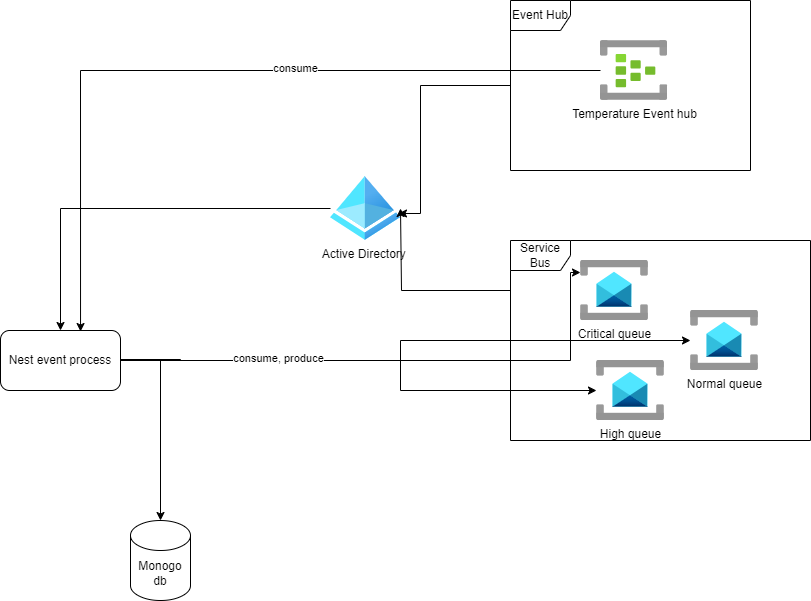

## Project Overview

### Description
This project is a Nest.js application built with TypeScript support. The system subscribes to an Azure Event Hub consumer upon startup, continuously listening for events representing sensor data from engines in a manufacturing environment. Upon receiving these events, the application processes them by sending the data to Azure Service Bus queues based on a criteria, which involves checking temperature thresholds. After sending the data to the queues, listeners are set up to consume these events and store them in MongoDB using Mongoose. Additionally, logging mechanisms using Winston are implemented to write logs to the console and to a retention file in the log directory.

### Features
- Built with Nest.js and TypeScript for robustness and maintainability.
- Utilizes Azure Event Hubs for receiving sensor data events.
- Processes incoming events based on specified criteria and sends them to Azure Service Bus queues.
- Listens to queues and stores consumed events in MongoDB using Mongoose for data persistence.
- Implements logging mechanisms using Winston to write logs to the console and a retention file.
- Includes a `data-sample.json` file to generate sample data for testing purposes.
- Provides a Docker Compose file for running a MongoDB container with Mongo Express.

### Setup
1. Clone the repository to your local machine.
2. Install dependencies using `npm install`.
3. Set up environment variables for authentication and configuration (e.g., Azure credentials, MongoDB connection string).
4. Run the application using `npm start`.

### Environment Variables
Make sure to set the following environment variables:

- `AZURE_CLIENT_ID`: The client ID of your Azure Active Directory application. 
- `AZURE_TENANT_ID`: The tenant ID (directory ID) of your Azure Active Directory.
- `AZURE_CLIENT_SECRET`: The client secret associated with your Azure Active Directory application.
- `EVENT_HUB_NAME`: The name of the Azure Event Hub.
- `EVENT_HUB_NAMESPACE`: The namespace of the Azure Event Hub.
- `CONSUMER_GROUP`: The name of the consumer group for the Azure Event Hub.
- `NORMAL_QUEUE_NAME`: The name of the normal queue in Azure Service Bus. (Default: "normal-temprature-queue")
- `CRITICAL_QUEUE_NAME`: The name of the critical queue in Azure Service Bus. (Default: "critical-temprature-queue")
- `HIGH_QUEUE_NAME`: The name of the high-priority queue in Azure Service Bus. (Default: "high-temprature-queue")
- `SERVICE_BUS_NAMESPACE`: The namespace of the Azure Service Bus.

### Prerequisites
In order to successfully configure the project to run, you need to create the following resources in your Azure environment:

1. **Azure Event Hub**:
   - Create an Azure Event Hub with the name specified in `EVENT_HUB_NAME`.
   - Obtain the connection string for the Event Hub and set it as the value for `EVENT_HUB_CONNECTION_STRING`.

2. **Azure Service Bus Queues**:
   - Create Azure Service Bus queues with the names specified in `NORMAL_QUEUE_NAME`, `CRITICAL_QUEUE_NAME`, and `HIGH_QUEUE_NAME`.
   - Obtain the connection string for the Service Bus and set it as the value for `SERVICE_BUS_CONNECTION_STRING`.
3. **Register Application in Azure Active Directory**:
   - Go to the Azure portal and register a new application in Azure Active Directory.
   - Obtain the client ID and tenant ID of the registered application and set them as the values for `AZURE_CLIENT_ID` and `AZURE_TENANT_ID` environment variables respectively.
   - Generate a client secret for the registered application and set it as the value for `AZURE_CLIENT_SECRET` environment variable.

4. **Assign Required Permissions**:
   - Assign the required permissions to the registered application to access Azure resources such as Azure Event Hub and Azure Service Bus.
   - Grant appropriate permissions for reading events from the Azure Event Hub and sending messages to Azure Service Bus queues.

### Logging
Logs are written to both the console and a retention file located in the log directory, looger has been configures using the Winston dependency.

### Usage
- Use the `data-sample.json` file to generate sample data for testing by sending it to the Azure Event Hub.
- Optionally, use the provided Docker Compose file (`docker-compose.yml`) to run a MongoDB container with Mongo Express. Execute `docker-compose up -d` in the project directory to start the containers. Access Mongo Express at `http://localhost:8081` to interact with the MongoDB instance.

### Contributing
Contributions to this project are welcome! Feel free to submit issues, feature requests, or pull requests on the project's GitHub repository.

